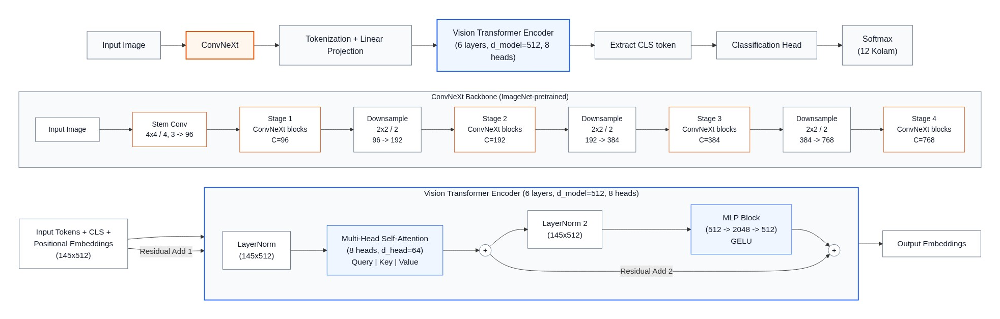

# Aparna Bindu v2

### AI-Powered Kolam Classification, Pattern Analysis and Interactive Design Platform

[](https://prabhu-omkar.github.io/AparnaBindu-v2/)
[](https://github.com/prabhu-omkar/AparnaBindu-v2/tree/main/model)
[](https://react.dev/)
[](https://www.typescriptlang.org/)
[](LICENSE)

A computational platform dedicated to preserving and exploring traditional South Indian Kolam line art through hybrid deep learning architectures and interactive vector design canvas tools.

---

## Table of Contents

- [Overview](#overview)
- [Key Features](#key-features)
- [Deep Learning Architecture](#deep-learning-architecture)
- [Model Evaluation & Insights](#model-evaluation--insights)
- [The 12 Kolam Categories](#the-12-kolam-categories)
- [Interactive Kolam Designer](#interactive-kolam-designer)
- [System Architecture](#system-architecture)
- [Tech Stack](#tech-stack)
- [Repository Structure](#repository-structure)
- [Installation and Setup](#installation-and-setup)
- [Inference API Reference](#inference-api-reference)
- [Docker Deployment](#docker-deployment)
- [Ethnomathematics of Kolam](#ethnomathematics-of-kolam)
- [Contributing](#contributing)
- [License](#license)

---

## Overview

Aparna Bindu v2 is an end-to-end research and design platform created to safeguard, catalog, and analyze traditional South Indian Kolam patterns (also known as Rangoli or Muggu). Practiced daily as an auspicious threshold tradition, Kolam embodies formal geometric properties, rotational symmetry, array grammars, and knot topology.

With rapid urban modernization, complex ancestral patterns risk disappearing without computational archiving. Aparna Bindu addresses this through modern software and machine learning engineering:

- **Automated Motif Classification**: An 88% top-1 accuracy deep learning hybrid classifier identifying 12 distinct classical motif families from real-world floor photographs.
- **Parametric Dot-Grid CAD Canvas**: An interactive browser drawing environment supporting Cartesian and isometric dot lattices with continuous Bezier stroke smoothing.
- **Curated Educational Archive**: A searchable digital collection containing categorized reference imagery, topological properties, and cultural context.

---

## Key Features

### Hybrid Neural Classification Engine
- **Cross-Platform Ingestion**: Upload images from local storage or capture live photos via mobile and desktop cameras.
- **Multi-Class Confidence Distributions**: Displays predicted class alongside top-3 probability confidence scores with certainty bars.
- **Adaptive Preprocessing**: Integrated bilateral filtering, contrast adjustment, morphological skeletonization, and centering to handle noisy floor surfaces.

### Interactive Vector Canvas Designer
- **Dual Lattice Dot Grids**: Toggle seamlessly between standard square (N x N) dot matrices and staggered isometric/hexagonal lattices.
- **Brahma-Mudi Knot Tracking**: Draw continuous looped paths encircling dots without self-intersection, honoring ancient knot theory principles.
- **Multi-Format Export**: Save creations as scalable vector graphics (SVG), high-resolution PNG, or parametric JSON files.

### Multi-Category Digital Archive
- **Filterable Category Matrix**: Explore traditional Kolam categories with instantaneous client-side tag filtering.
- **Detailed Lightbox Modal**: Inspect specimens with zoom controls, backdrop blur, stroke amplification, and symmetry notes.
- **Responsive Masonry Gallery**: Optimized rendering using CSS grid and image lazy loading across mobile and desktop displays.

---

## Deep Learning Architecture

Standard Convolutional Neural Networks (CNNs) capture local spatial patterns effectively but struggle with global topological loop closures. Vision Transformers (ViTs), on the other hand, excel at long-range rotational dependencies but perform poorly on sparse line drawings due to the absence of spatial inductive biases.

Aparna Bindu v2 resolves this fundamental tradeoff using a custom hybrid neural network architecture combining an ImageNet-pretrained **ConvNeXt** backbone for localized stroke feature extraction and a **Vision Transformer (ViT)** encoder for global structural context modeling:

<div align="center">
  
  <p><em>Fig. 1: Proposed Aparnabindu Architecture: (a) The overall hybrid workflow. (b) The ConvNeXt backbone for local feature extraction. (c) Vision Transformer module for global structural context modeling.</em></p>
</div>

### Architectural Workflow

The model processes hand-drawn or powdered Kolams through an end-to-end four-stage pipeline:

1. **Input & ConvNeXt Feature Extractor (Local Inductive Bias)**:
   - Initial 4x4 convolutional stem with stride 4 transforms 3-channel RGB image into 96 feature channels.
   - 4 hierarchical stages of ConvNeXt blocks with progressive channel capacities (C = 96, 192, 384, 768).
   - 2x2 spatial downsampling layers with stride 2 between stages to model multi-scale stroke connectivity.
   - Preserves line continuity, dot-to-line proximity invariants, and junction topologies.

2. **Tokenization and Linear Projection**:
   - Converts the dense convolutional feature map into 144 spatial patch tokens.
   - Linearly projects token dimension to d_model = 512.
   - Appends a learnable classification [CLS] token and adds 1D learnable positional embeddings (145x512 total sequence).

3. **Vision Transformer Encoder (Global Symmetry Modeling)**:
   - 6 stacked Transformer encoder layers with hidden dimension d_model = 512.
   - Multi-Head Self-Attention (MHSA) with 8 attention heads (head dimension d_head = 64) for rotational invariant modeling.
   - Two-stage LayerNorm normalization with residual addition skip connections (Residual Add 1 and 2).
   - Multi-Layer Perceptron (MLP) with 512 -> 2048 -> 512 expansion and GELU activation.

4. **Classification Head & Output**:
   - Extracts the 512-dimensional aggregated [CLS] token representation.
   - Passes through a linear projection layer mapping 512 latent features to 12 Kolam classes.
   - Softmax normalization produces the final probability distribution across all 12 categories.

---

## Model Evaluation & Insights

The hybrid architecture was thoroughly evaluated under rigorous 5-fold cross-validation protocols:

- **Top-1 Accuracy**: 88.02% across unseen validation splits.
- **Macro ROC-AUC**: 95.76%, demonstrating strong class separability even among visually similar floral categories.
- **Macro F1-Score**: 86.33%, reflecting balanced precision and recall across rare and frequent pattern types.
- **Top-3 Accuracy**: 97.40%, ensuring that the true category is almost always represented within top suggestions.

### Key Research Findings
- **Inductive Bias Matters**: Pure Vision Transformers failed to generalize on sparse stroke drawings (scoring ~35% accuracy) because self-attention without convolutional priors cannot easily learn edge continuity from limited datasets.
- **Hybrid Synergy**: Pairing ConvNeXt depthwise convolution stems with self-attention transformer blocks yielded a +1.86% absolute accuracy gain over pure CNN baselines, with significantly higher confidence calibration.

---

## The 12 Kolam Categories

Aparna Bindu classifies Kolams across 12 classical motif families:

- **1. Butterfly**: Symmetrical winged silhouettes featuring mirrored dual-loop enclosures and curved antennae (C2 symmetry).
- **2. Cow**: Sacred bovine representations traditionally drawn during Pongal with horns, hump outlines, and bells.
- **3. Creeper**: Continuous undulating vine motifs (Kodi Kolam) with sinusoidal wave periodicity and alternating buds.
- **4. Elephant**: Majestic royal tusker outlines and Ganesha-inspired threshold drawings symbolizing wisdom and fortune.
- **5. Fish**: Interlocking aquatic curves with radial 4-fold or 8-fold arrangements around a central dot hub.
- **6. Flower**: Multi-petal radial geometry radiating from a central dot (Bindu) displaying D4 dihedral group symmetry.
- **7. Footprint**: Sacred Lakshmi Pada motifs depicting divine footsteps entering the home to bestow prosperity.
- **8. Geometric**: Mathematical polygon configurations including interlaced triangles, Yantras, and nested rhombuses.
- **9. Kambi**: Continuous line-drawing Kolams where closed loops navigate around dots without intersecting.
- **10. Loops**: Intricate knotwork topologies (Sikku or Brahma Mudi) representing eternity through single unending threads.
- **11. Om**: Sacred Devanagari and Tamil Om typography seamlessly merged into traditional dot matrices.
- **12. Peacock**: Avian outlines featuring elaborate crested heads, curved necks, and sweeping fan-shaped plumage spirals.

---

## Interactive Kolam Designer

The built-in browser designer allows enthusiasts, researchers, and students to construct Kolams parametrically:

- **Lattice Dimensions**: Select grid dimensions ranging from compact 3x3 grids up to large-scale 15x15 dot arrays.
- **Dot-Grid Mathematics**: Cartesian coordinates (x, y) for square grids and triangular lattice vectors for hexagonal layouts.
- **Magnetic Snapping**: Automatically snaps cursor inputs to dot centers or precise quadrant midpoints.
- **Curved Stroke Engine**: Interpolates discrete coordinates into smooth cubic Bezier paths for authentic fluidity.
- **Traditional Color Palette**: Draw in traditional white rice powder, terracotta red (Kaavi), turmeric yellow, or vermilion.
- **History Management**: Full multi-level undo and redo stack for uninterrupted creative workflow.

---

## System Architecture

The platform follows a decoupled, three-tier cloud-ready architecture designed for high throughput and sub-50ms inference:

- **Client Presentation Tier (Frontend)**:
  - Developed with React 19, TypeScript 5.0, Vite 7, and Tailwind CSS 4.
  - Houses the interactive vector dot-grid canvas with cubic Bezier interpolation for drawing and exporting Kolams.
  - Implements the live camera capture and multi-file image classification interface.
  - Features a responsive masonry archive with tag filtering and full-screen modal lightbox inspection.

- **Inference Service Tier (Backend Microservice)**:
  - High-throughput asynchronous REST API built with FastAPI and Uvicorn on Python 3.10+.
  - Autonomous image preprocessing pipeline: bilateral filtering, CLAHE contrast enhancement, and morphological skeletonization.
  - Loads the optimized PyTorch KolamConvNeXtViT checkpoint into GPU/CPU memory with JIT tracing.
  - Exposes `/predict` endpoint returning Top-1 and Top-3 calibrated category confidences with latency metrics.

- **Deployment & Continuous Integration Infrastructure**:
  - Web client statically built and automatically deployed to GitHub Pages via automated GitHub Actions CI/CD workflows.
  - Backend packaged as a portable Docker container for scalable cloud deployment (Hugging Face Spaces, Render, or AWS).

---

## Tech Stack

### Web Frontend
- **Framework**: React 19 with Concurrent Rendering
- **Language**: TypeScript 5.0 with strict type-checking
- **Tooling & Styling**: Vite 7, Tailwind CSS 4 with custom glassmorphism tokens
- **Libraries**: Lucide React (icons), Framer Motion (animations), React Router DOM v7

### Machine Learning Backend
- **Framework**: FastAPI + Uvicorn ASGI server
- **Deep Learning**: PyTorch 2.0+, Torchvision, timm (PyTorch Image Models)
- **Computer Vision**: OpenCV (opencv-python-headless), Pillow (PIL), NumPy
- **Containerization**: Docker

---

## Repository Structure

```
AparnaBindu-v2/
|-- .github/workflows/deploy.yml   # GitHub Pages CI/CD workflow
|-- docs/mermaid_architecture.png  # Mermaid architectural diagram
|-- model/                         # ML Backend & Inference Microservice
|   |-- Dockerfile                 # Container specification
|   |-- requirements.txt           # Python backend dependencies
|   |-- server.py                  # FastAPI REST application
|   |-- kolam_hybrid_model.py      # KolamConvNeXtViT architecture
|   |-- kolam_dataset.py           # Dataset loaders and augmentations
|   |-- prepocesses.py             # Image thresholding and normalization
|   |-- predict_single_image.py    # Command-line prediction utility
|   `-- kolam_convnext_vit_best(early).pth # Model weights pointer
|-- public/kolam_gallery/          # Categorized gallery datasets (12 classes)
|-- src/                           # React frontend source code
|   |-- components/                # UI components (Designer, Gallery, Classify)
|   |-- App.tsx                    # Root application router
|   |-- main.tsx                   # Client entrypoint
|   `-- index.css                  # Global Tailwind styling
|-- index.html                     # HTML entrypoint
|-- package.json                   # NPM dependencies & scripts
|-- tsconfig.json                  # TypeScript configuration
|-- vite.config.ts                 # Vite build configuration
|-- LICENSE                        # MIT License
`-- README.md                      # Project documentation
```

---

## Installation and Setup

### Prerequisites
- Node.js (v18.0+) & npm / yarn
- Python 3.10+ (for local inference backend)
- Git with Git-LFS installed

### 1. Clone the Repository
```bash
git clone https://github.com/prabhu-omkar/AparnaBindu-v2.git
cd AparnaBindu-v2
```

### 2. Run Frontend Client
```bash
npm install
npm run dev
```
The application will be live at `http://localhost:5173`.

### 3. Run Backend Model Server (Optional)
```bash
cd model
python -m venv venv
source venv/bin/activate  # Windows: .\venv\Scripts\activate
pip install -r requirements.txt
python server.py
```
The inference API will be accessible at `http://localhost:8000`.

---

## Inference API Reference

### Predict Kolam Motif
- **Method**: `POST` | **Route**: `/predict` | **Content-Type**: `multipart/form-data`

#### Example Request (cURL)
```bash
curl -X POST 'http://localhost:8000/predict' -F 'file=@/path/to/kolam.jpg'
```

#### Successful Response Schema (`200 OK`)
```json
{
  "status": "success",
  "predicted_class": "peacock",
  "confidence": 0.9421,
  "top_3": [
    { "class": "peacock", "probability": 0.9421 },
    { "class": "butterfly", "probability": 0.0384 },
    { "class": "flower", "probability": 0.0112 }
  ],
  "latency_ms": 48.2
}
```

---

## Docker Deployment

The inference backend can be packaged into a portable Docker container:

```bash
docker build -t aparnabindu-ml:v2 ./model
docker run -d -p 8000:8000 --name aparnabindu-server aparnabindu-ml:v2
curl http://localhost:8000/health
```

---

## Ethnomathematics of Kolam

Kolam represents one of the world's oldest continuous traditions of ethnomathematics:

1. **Formal Array Grammars**: Computer scientists have demonstrated that Kolams can be generated via 2D extensions of Chomsky grammars (Kolam Array Grammars), proving that traditional artists intuitively apply recursive syntactic rules.
2. **Eulerian Circuits**: Sikku patterns adhere to graph theory constraints where an unbroken line traces every edge of an underlying planar graph without retraversing any segment.
3. **Symmetry Group Invariance**: Traditional motifs systematically explore dihedral groups (D2, D4) and cyclic groups (C2, C4), creating ideal benchmarks for evaluating rotational equivariance in computer vision algorithms.

---

## Contributing

Contributions to Aparna Bindu v2 are welcome. Whether you wish to contribute new training imagery, improve canvas designer ergonomics, or optimize inference speed:

1. Fork the repository.
2. Create a dedicated feature branch (`git checkout -b feature/NewFeature`).
3. Commit your modifications (`git commit -m 'feat: introduce new feature'`).
4. Push your branch to GitHub (`git push origin feature/NewFeature`).
5. Submit a descriptive Pull Request.

---

## License

This project is licensed under the **MIT License**. See the [LICENSE](LICENSE) file for complete terms and conditions.
